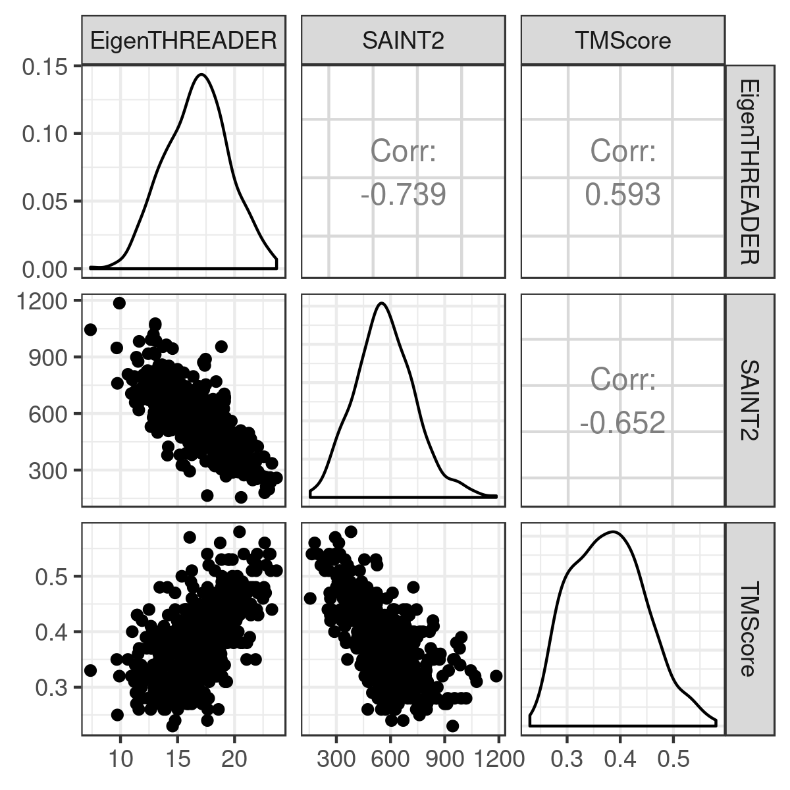
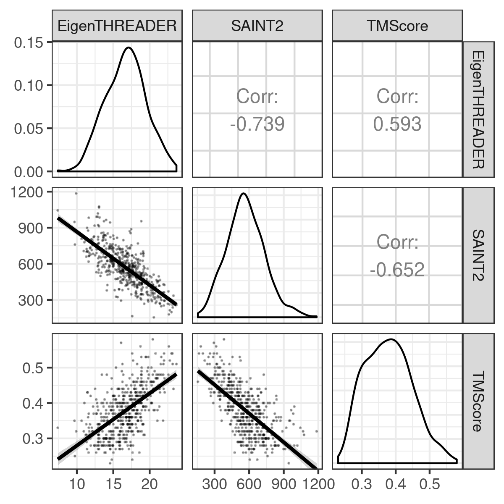
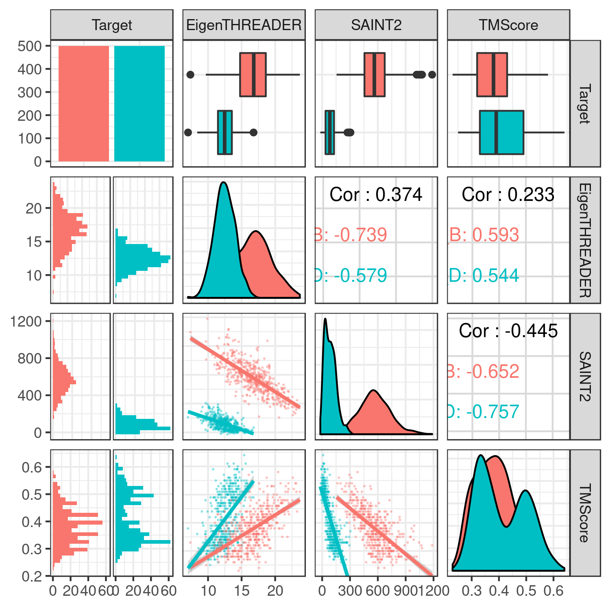
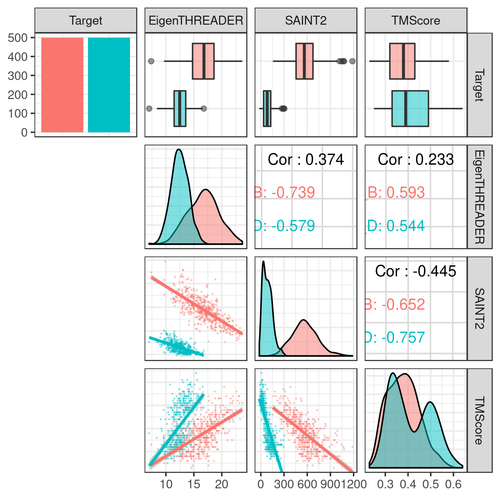

# Some tidyverse things

Reading in many files with specified file extensions, and merging the results into a dataframe
```R
gather_files = function(extension, colnames){
  df <- lapply(list.files(pattern = paste(".*\\.{1}",extension,"$",sep="")), FUN=read.table, col.names=colnames, stringsAsFactors=FALSE, fill=TRUE) %>% bind_rows()
  return(df)
}

manyfiles <- list(gather_files("somefileextension", c("columnname1","columnname2")),
                     gather_files("anotherfileextensions",c("columnname1","columnname3")))

df <- Reduce(function(...) merge(..., by='columnname1', all.x=TRUE), manyfiles)
```

### joining
e.g. inner_join()
inner:  only rows with matching keys in both x and y
left:   all rows in x, adding matching columns from y
right:  all rows in y, adding matching columns from x
full:   all rows in x with matching columns in y, then the rows of y that don't match x.

# Some ggplot2 things 

### Make theme_bw() the default
```R
# In a session:
new_theme <- theme_bw()
theme_set(new_theme)

# Permanently by adding to .Rprofile
setHook(packageEvent("ggplot2", "onLoad"), 
        function(...) ggplot2::theme_set(ggplot2::theme_bw()))
```

### Grid lines
```R
# Remove grid lines
ggplot(df, aes(x=x, y=y)) +
    theme(panel.grid.major = element_blank(),     # all major
          panel.grid.minor = element_blank(),     # all minor
          panel.grid.major.x = element_blank(),   # x major
          panel.grid.major.y = element_blank())   # y major
```

### Add space between facet panels
```R
ggplot(df, aes(x=x, y=y)) +
    theme(panel.spacing.x = unit(4,"mm"))
```

### Change facet labels
```R
facet_labels <- c(`afactorlevel` = "Readable version", `anotherfactorlevel` = "Another readable version")
ggplot(df, aes(x=x, y=y)) +
    facet_wrap(~somefactor, labeller = as_labeller(facet_labels))
```

### Rotate axis labels:
```R
ggplot(df, aes(x=x, y=y)) +
    theme(axis.text.x = element_text(angle = 90, hjust = 1))
```

### Point shapes


# Using cowplot

[cowplot documentation](https://cran.r-project.org/web/packages/cowplot/vignettes/introduction.html) 

```R
library(cowplot)

fig <- plot_grid(p1, p2, labels="auto", ncol=2, rel_widths=c(0.5, 1))

```

# ggpairs for correlation plots

GGpairs is useful for exploring data distributions and correlations.

[GGpairs documentation](https://www.rdocumentation.org/packages/GGally/versions/1.4.0/topics/ggpairs)


```R
library(tidyverse)
library(GGally)
trainingset = read.table("https://raw.githubusercontent.com/clarewest/RFQAmodel/master/data/RFQAmodel_training.txt", header=TRUE, stringsAsFactors=FALSE)
trainingset %>% 
  filter(Target=="2OBA_B") %>% 
  select(EigenTHREADER, SAINT2, TMScore) %>%
  ggpairs()

```


Each combination of variables are plotted according to whether they are:

- continuous: e.g. points (lower default), smooth, density, cor (upper default), or ignored ("blank")
- combo: e.g. "box_no_facet" (upper default), dot, facetdeinsity, denstrip, or ignored ("blank")
- discrete: e.g. facetbar (default), ratio, or ignored ("blank")

Plots in the upper and lower triangles and the diagonal are modified separately. The options and parameters are passed to each as a list.

```R

trainingset %>% 
  filter(Target=="2OBA_B") %>% 
  select(EigenTHREADER, SAINT2, TMScore) %>%
  ggpairs(., lower = list(continuous = wrap("smooth", alpha = 0.3, size=0.1)))

```



Aesthetics are mapped like this:


```R

trainingset %>% 
  filter(Target %in% c("2OBA_B","3HSB_D")) %>% 
  select(Target, EigenTHREADER, SAINT2, TMScore) %>%
  ggpairs(., 
          mapping = ggplot2::aes(colour=Target), 
          lower = list(continuous = wrap("smooth", alpha = 0.3, size=0.1)))

```



```R
trainingset %>% 
  filter(Target %in% c("2OBA_B","3HSB_D")) %>% 
  select(Target, EigenTHREADER, SAINT2, TMScore) %>%
  ggpairs(., 
          mapping = ggplot2::aes(colour=Target), 
          lower = list(continuous = wrap("smooth", alpha = 0.3, size=0.1), 
                       discrete = "blank", combo="blank"), 
          diag = list(discrete="barDiag", 
                      continuous = wrap("densityDiag", alpha=0.5)), 
          upper = list(combo = wrap("box_no_facet", alpha=0.5)))
                       
          )
```


